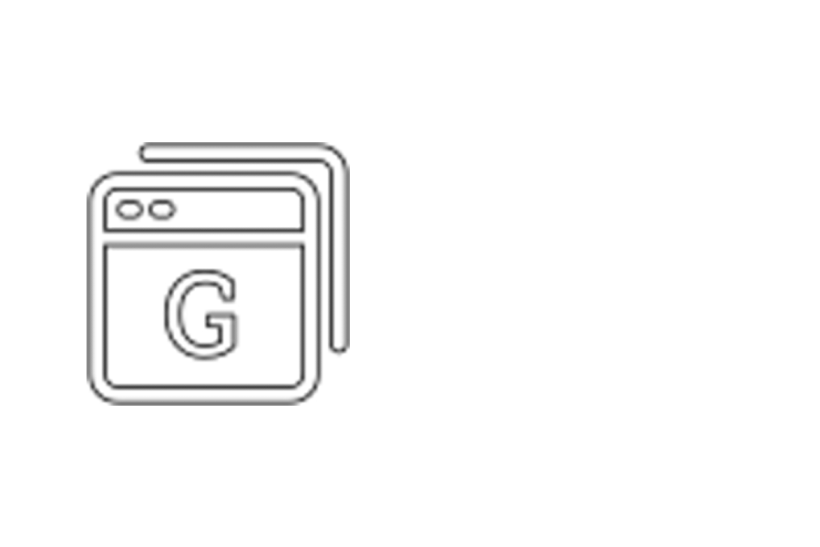

<p align="center">

</p>

<h1 align="center">Gustavo Browser</h1>

> O projeto consiste em um navegador flutuante utilizando ElectronJS, derivado do Chromium. Seus diferenciais para um navegador convencional é a simplicidade e o fato de ser fixo na tela, ou seja, mesmo com um cliques na tela ele continua visível

## 💻 Pré-requisitos

Antes de começar, verifique se você atendeu aos seguintes requisitos:
* Você instalou a versão mais recente do `Node / NPM`

## 🚀 Instalando

Para instalar o Gustavo Browser, siga estas etapas:

Qualquer SO:
```
git clone https://github.com/soaresgus/gustavo-browser.git //Caso não tenha o git instalado, baixe o repositório.
cd gustavo-browser/
npm install
```

## ☕ Utilização

Para usar o Gustavo Browser, siga estas etapas:

```
//Dentro do diretório do projeto
npm start
```

## 📫 Contribuindo

1. Bifurque este repositório.
2. Crie um branch: `git checkout -b <nome_branch>`.
3. Faça suas alterações e confirme-as: `git commit -m '<mensagem_commit>'`
4. Envie para o branch original: `git push origin <nome_do_projeto> / <local>`
5. Crie a solicitação de pull.

Como alternativa, consulte a documentação do GitHub em [como criar uma solicitação pull](https://help.github.com/en/github/collaborating-with-issues-and-pull-requests/creating-a-pull-request).

## 🤝 Colaboradores

Pessoas responsáveis em tornar esse projeto possível:

<table>
  <tr>
    <td align="center">
      <a href="#">
        <br>
        <sub>
          <b>Gustavo Soares</b>
        </sub>
      </a>
    </td>
  </tr>
</table>

<p>Feito com ❤️ por Gustavo Soares.</p>
<p>Agradeço à atenção.</p>

[⬆ Voltar ao topo](#nome-do-projeto)<br>
